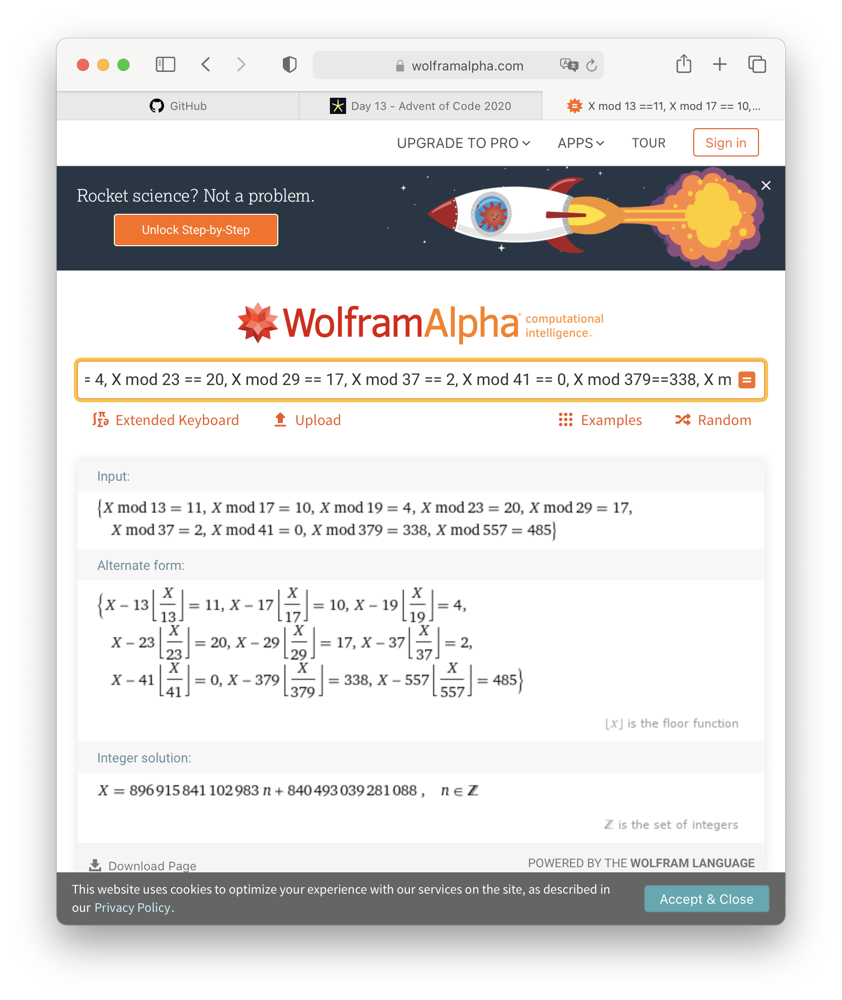

# Day 13

## Part B

Brute Force 是不可以的。

```
However, with so many bus IDs in your list, surely the actual earliest timestamp will be larger than 100000000000000!
```

不敢想象这么一点点输入会有这么爆炸性的结果…

```
41,x,x,x,x,x,x,x,x,x,x,x,x,x,x,x,x,x,x,x,x,x,x,x,x,x,x,x,x,x,x,x,x,x,x,37,x,x,x,x,x,379,x,x,x,x,x,x,x,23,x,x,x,x,13,x,x,x,17,x,x,x,x,x,x,x,x,x,x,x,29,x,557,x,x,x,x,x,x,x,x,x,x,x,x,x,x,x,x,x,x,19
```

不如化成简单一点的样子：

```python
{
    0: '41',
    35: '37', 
    41: '379', 
    49: '23', 
    54: '13', 
    58: '17', 
    70: '29', 
    72: '557', 
    91: '19'
}
```

也就是说，我们要找出一个整数 $X$，他同时满足：

* $X \pmod{41} \equiv 0$
* $X + 35 \pmod{37} \equiv 0$
* $X + 41 \pmod{379}\equiv 0$
* $X + 49 \pmod{23} \equiv 0$
* $X + 54 \pmod{13} \equiv 0$
* $X + 58 \pmod{17} \equiv 0$
* $X + 70 \pmod{29} \equiv 0$
* $X + 72 \pmod{557} \equiv 0$
* $X + 91 \pmod{19} \equiv 0$

做简单的模等价变换，我们有：

* $X \pmod{41} \equiv 0$
* $X \pmod{37} \equiv 2$
* $X \pmod{379} \equiv 338$
* $X \pmod{23} \equiv 20$
* $X \pmod{13} \equiv 11$
* $X \pmod{17} \equiv 10$
* $X \pmod{29} \equiv 17$
* $X \pmod{557} \equiv 485$
* $X \pmod{19} \equiv 4$

排个序，得到

* $X \pmod{13} \equiv 11$
* $X \pmod{17} \equiv 10$
* $X \pmod{19} \equiv 4$
* $X \pmod{23} \equiv 20$
* $X \pmod{29} \equiv 17$
* $X \pmod{37} \equiv 2$
* $X \pmod{41} \equiv 0$
* $X \pmod{379}\equiv 338$
* $X \pmod{557} \equiv 485$



结果是 `840493039281088 + 896915841102983 * n`

即，最小结果是 `840493039281088`。

> 模算数真的真的真的太好了

